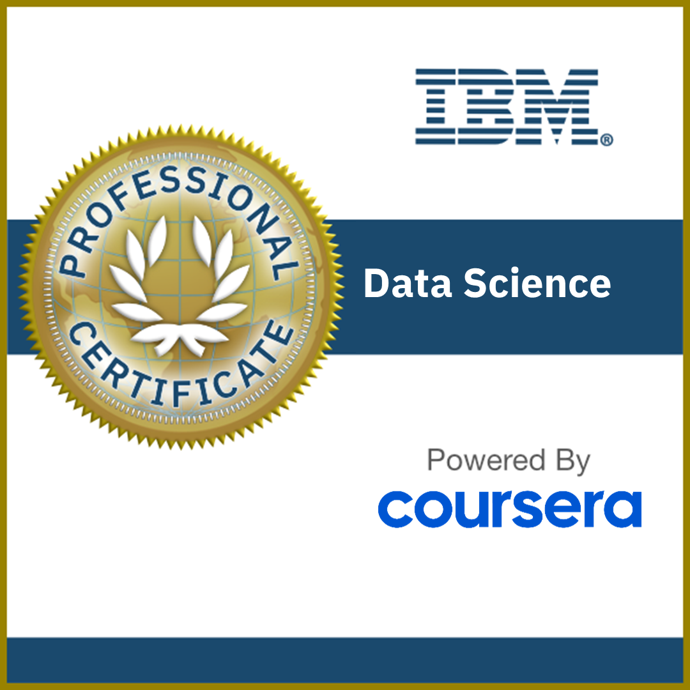

# Hello World! I'm [Tapaswi Satyapanthi](https://www.linkedin.com/in/tapaswi-v-s/)

I’m a Data Enthusiast with a solid foundation in software engineering. After spending 4 years building robust software solutions, I ventured into the world of Data Science and AI in 2022, where I discovered that models could do more than just answer questions—they could turn raw data into insightful narratives and create experiences that feel almost magical.

Today, I’m expanding my expertise at [Northeastern University](https://northeastern.edu), diving deep into Generative AI, ML models, Neural Networks, and Data Engineering. 

### My mission now? 
To blend my software engineering skills with the power of LLMs and advanced models, crafting cutting-edge applications and systems that push the boundaries of what’s possible with data.

- View my [Resume](https://drive.google.com/file/d/1WZEBLgU-35Cxh5lSMcvmL92ytwuShmE6/view?usp=drive_link) or rather [Chat with my Resume?](https://tapaswi.streamlit.app/)
- [Discover my Interesting Projects](#key-projects)
- [View My Certifications](#certifications)
- [My Industrial Experience](#industrial-experience)
- Connect me on:
    - [LinkedIN](https://www.linkedin.com/in/tapaswi-v-s/) or
    - [Email Me](mailto://satyapanthi.t@northeastern.edu)

### Here's Few Technologies I work with

#### _Languages_:   

#### _Data Engineering Tools_:  

#### _Data Science Tools_:      

#### _Back-end & Front-end SWE_:   

#### _Databases_:   

#### _Version Control_:    

#### _Containerization_:   

# Key Projects

## LLM Projects - Surfing the AI Wave
- [SQL-Agent](https://github.com/tapaswi-v-s/SQL-Agent): An Agentic Chatbot to Interact with a relational Database in a natural language.
- [AWSage](https://github.com/tapaswi-v-s/awsage): A transformed way to interact with FAQs. RAG Chatbot with Web-Search functionality built using [Amazon Compute FAQs](https://aws.amazon.com/ec2/faqs/).
- [WaLL-E](): A personalized assistant that leverages your resume to share information about you—an impressive addition to any personal portfolio website!

## Traditional ML Ventures - Balancing on the AI Surfboard
- [Asteroid Hazard Classification](https://github.com/tapaswi-v-s/data-science/tree/9fac4e9d1d992c94b68adfc8ff0205a405fb50fd/machine-learning/asteroid-hazard-classification): Predicting whether an asteroid is hazardous for our earth or not based on past data.
- [Music Genre Classification](https://github.com/tapaswi-v-s/data-science/tree/9fac4e9d1d992c94b68adfc8ff0205a405fb50fd/machine-learning/music-genre-classification): Identifying to which genre a particular musical track belongs to.

- [Pulsar Star Classification](https://github.com/tapaswi-v-s/data-science/tree/9fac4e9d1d992c94b68adfc8ff0205a405fb50fd/machine-learning/pulsar-star-classification): Classifying whether a given star is a pulsar or not.

- [TTC Subway Delay Prediction](https://github.com/tapaswi-v-s/data-science/tree/9fac4e9d1d992c94b68adfc8ff0205a405fb50fd/machine-learning/ttc-subway-delay-prediction): Predicting the delay time of the Toronto's Subway.

## Data Engineering Projects - Harvesting Fuel for AI
- [ETL-and-Data-Pipelines](https://github.com/tapaswi-v-s/ETL-and-Data-Pipelines): My Work on building ETL Solutions mainly with [Apache Airflow](https://airflow.apache.org/) and [Kafka](https://kafka.apache.org/).

# Certifications
<a href='https://coursera.org/verify/professional-cert/QKY3XXXGQ3PG'>
</img>
</a>

A 10-course specialization offered by IBM on Coursera, providing a comprehensive journey from introductory to advanced Data Science, covering key topics such as SQL & Databases, Data Analysis, Visualization, and Machine Learning—all powered by amazing Python!

---

# Industrial Experience
 
</img>

### Graduate Teaching Assistant
__*Sep 2024 - Present*__ 
TA For the course *__Application Engineering and development__*. 
My responsibilities include conducting labs for the course and *__teaching Java Programming and System Design fundamentals__* to the students. 

---

</img>

### Software Engineer
__*Mar 2024 - Present, Part-Time, Remote*__ 
Designed and implemented a full-featured ticketing system using Django for the backend and Flutter for the mobile app, and currently leading the development of an HR system, including Leave and Payroll management, with the same technology stack.

---

</img>

### Systems Engineer 
_**Apr 2022 - Dec 2023**_ 
Developed and optimized Flutter applications for [Schlumberger](https://www.slb.com/), *__enhanced performance by 30%__*, lead a widget library project, *__achieved 70% code coverage through testing__*, and __*reducing development time by 25%*__ through refactoring and efficient practices.

---

</img>

### Software Engineer
_**Jan 2020 - Mar 2022**_ 
Led a team to develop and deploy the [OnlineLR app](https://www.onlinelr.com/) across Android, iOS, and web platforms using Flutter, *__improving execution speed by 20%__*, *__reducing deployment time by 50%__* with a CI/CD pipeline, and mentored junior developers.